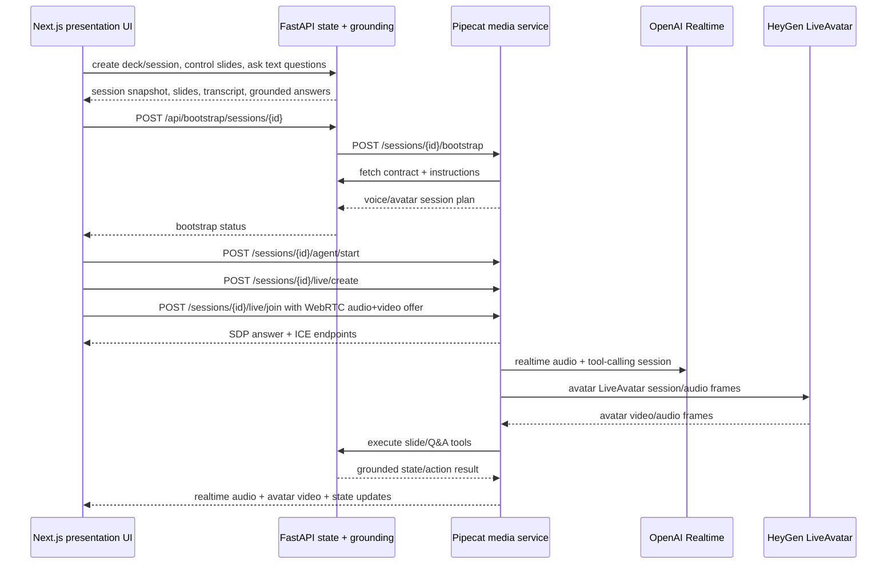

# Pipecat live voice/avatar contract

This doc captures the current live media architecture for the MVP: Pipecat owns the browser WebRTC session, OpenAI Realtime owns the conversational voice intelligence, and HeyGen LiveAvatar supplies the video avatar stream.

## Goal
Make Pipecat the live media orchestrator while FastAPI remains the source of truth for deck/session state.

The live path should:
- load prompt/instructions from FastAPI
- use the FastAPI tool manifest for slide state, search, navigation, pause/resume, and grounded Q&A
- expose a stable Pipecat agent/session contract to the web app
- use one browser WebRTC connection for microphone input plus remote audio/video output
- send OpenAI Realtime audio responses through Pipecat
- render HeyGen LiveAvatar video through Pipecat `HeyGenVideoService` when HeyGen is configured
- keep `/sessions/{id}/ask` as a transcript-injection test/dev harness

## Current architecture

## Runtime contracts

### FastAPI owns
- deck metadata and generated slide assets
- presentation session status/current slide/autoplay
- transcript and live events
- grounded Q&A
- tool endpoints for current slide, search, navigation, pause/resume, and slide content
- realtime contract/bootstrap metadata consumed by Pipecat and the web app

### Pipecat owns
- live voice/avatar session lifecycle
- browser WebRTC offer/answer/ICE handling
- negotiation of remote audio and avatar video tracks
- OpenAI Realtime session config
- HeyGen `HeyGenVideoService` lifecycle when `HEYGEN_LIVE_AVATAR_API_KEY` or `HEYGEN_API_KEY` is configured
- realtime tool dispatch into FastAPI
- transcript-injection `/ask` harness for automated proof

### Web owns
- operator and presentation UI
- slide controls
- text Q&A and simulated voice harness
- live voice/avatar start/stop and WebRTC client connection
- attaching remote audio to a hidden audio element and remote avatar video to `HeyGenAvatarPanel`

## Key endpoints

FastAPI:
- `POST /api/bootstrap/sessions/{session_id}`
- `GET /api/realtime/sessions/{session_id}/contract`
- `GET /api/realtime/sessions/{session_id}/instructions`
- `POST /api/sessions/{session_id}/ask`
- slide tool endpoints under `/api/sessions/{session_id}/...`

Pipecat:
- `GET /health` reports `openaiConfigured`, `heygenConfigured`, `videoConfigured`, and Pipecat runtime availability
- `POST /sessions/{session_id}/bootstrap`
- `POST /sessions/{session_id}/agent/start`
- `GET /sessions/{session_id}/agent/state`
- `POST /sessions/{session_id}/agent/stop`
- `POST /sessions/{session_id}/live/create`
- `POST /sessions/{session_id}/live/join`
- `POST /sessions/{session_id}/live/ice`
- `GET /sessions/{session_id}/live/state`
- `POST /sessions/{session_id}/live/stop`
- `POST /sessions/{session_id}/ask` for transcript-injection tests/dev proof

## Configuration notes

Required for live voice:
- `OPENAI_API_KEY`
- optional `OPENAI_REALTIME_MODEL`

Required for avatar video:
- `HEYGEN_LIVE_AVATAR_API_KEY` preferred, or local-compatible alias `HEYGEN_API_KEY`
- `HEYGEN_AVATAR_ID` for non-sandbox avatars
- `HEYGEN_SANDBOX=true` plus `HEYGEN_SANDBOX_AVATAR_ID` for the HeyGen sandbox avatar
- optional `HEYGEN_VIDEO_WIDTH` / `HEYGEN_VIDEO_HEIGHT` to control outgoing avatar video size; defaults are intentionally modest for local stability

## Validation gates
- `python3 -m py_compile apps/pipecat/server.py apps/api/app/config.py`
- `npm run test:api`
- `npm run lint:web`
- `npm run build:web`
- `npm run test:voice-proof` against a running stack
- For avatar video specifically: verify Pipecat `/health` has `videoConfigured:true`, then inspect `/sessions/{id}/live/state` for `video_pipeline_enabled:true`, `heygen_ready:true`, and no `last_error`; browser `webrtc-internals` should show a negotiated remote video receiver.

## Current MVP boundaries
- The active demo path is a server-orchestrated live voice + HeyGen video avatar over Pipecat WebRTC.
- Live voice requires Pipecat plus OpenAI Realtime credentials.
- Avatar video requires HeyGen credentials and a compatible sandbox/non-sandbox avatar configuration.
- Text Q&A and simulated voice remain useful for non-live proof and regression testing.
- The automated media proof validates SDP answer, ICE exchange, and remote audio receiver; full spoken-audio automation and strict avatar-frame assertions remain later slices.
